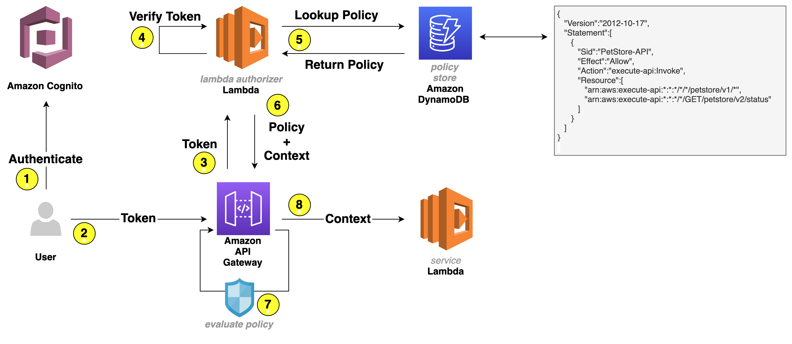

# Building fine-grained authorization using Amazon Cognito, API Gateway, and IAM

Authorizing functionality of an application based on group membership is a best practice. If you’re building APIs with [Amazon API Gateway](https://aws.amazon.com/api-gateway/) and you need fine-grained access control for your users, you can use [Amazon Cognito](https://aws.amazon.com/cognito/). Amazon Cognito allows you to use groups to create a collection of users, which is often done to set the permissions for those users. In this post, I show you how to build fine-grained authorization to protect your APIs using Amazon Cognito, API Gateway, and [AWS Identity and Access Management (IAM)](https://aws.amazon.com/iam/).

## Solution Overview
   
You will learn how to use an [Amazon Cognito user pool](https://docs.aws.amazon.com/cognito/latest/developerguide/cognito-user-identity-pools.html) as a user directory and let users authenticate and acquire the [JSON Web Token (JWT)](https://tools.ietf.org/html/rfc7519) to pass to the API Gateway. The JWT is used to identify what group the user belongs to, as mapping a group to an IAM policy will display the access rights the group is granted.

`Note`: The solution works similarly if Amazon Cognito would be federating users with an external identity provider (IdP)—such as Ping, Active Directory, or Okta—instead of being an IdP itself. To learn more, see [Adding User Pool Sign-in Through a Third Party](https://docs.aws.amazon.com/cognito/latest/developerguide/cognito-user-pools-identity-federation.html). Additionally, if you want to use groups from an external IdP to grant access, [Role-based access control using Amazon Cognito and an external identity provider](https://aws.amazon.com/blogs/security/role-based-access-control-using-amazon-cognito-and-an-external-identity-provider/) outlines how to do so.

### Architecture reference (Request Flow):

The following figure shows the basic architecture and information flow for user requests.



**Figure 1 – User request flow**

Let’s go through the request flow to understand what happens at each step, as shown in Figure 1:

1.	A user logs in and acquires an Amazon Cognito JWT ID token, access token, and refresh token. To learn more about each token, see [using tokens with user pools](https://docs.aws.amazon.com/cognito/latest/developerguide/amazon-cognito-user-pools-using-tokens-with-identity-providers.html).
2.	A RestAPI request is made and a bearer token—in this solution, an access token—is passed in the headers.
3.	API Gateway forwards the request to a Lambda authorizer—also known as a custom authorizer.
4.	The Lambda authorizer verifies the Amazon Cognito JWT using the Amazon Cognito public key. On initial Lambda invocation, the public key is downloaded from Amazon Cognito and cached. Subsequent invocations will use the public key from the cache.
5.	The Lambda authorizer looks up the Amazon Cognito group that the user belongs to in the JWT and does a lookup in [Amazon DynamoDB](https://aws.amazon.com/dynamodb/) to get the policy that’s mapped to the group.
6.	Lambda returns the policy and—optionally—context to API Gateway. The context is a map containing key-value pairs that you can pass to the upstream service. It can be additional information about the user, the service, or anything that provides additional information to the upstream service.
7.	The API Gateway policy engine evaluates the policy.  
    `Note`: Lambda isn’t responsible for understanding and evaluating the policy. That responsibility falls on the native capabilities of API Gateway.
8.	The request is forwarded to the service.

`Note`: To further optimize Lambda authorizer, the authorization policy can be cached or disabled, depending on your needs. By enabling cache, you could improve the performance as the authorization policy will be returned from the cache whenever there is a cache key match. To learn more, see [Configure a Lambda authorizer using the API Gateway console](https://docs.aws.amazon.com/apigateway/latest/developerguide/configure-api-gateway-lambda-authorization-with-console.html).

Let’s have a closer look at the example policy that is stored as part of an item—shown in Figure 2—in DynamoDB.

    {
       "Version":"2012-10-17",
       "Statement":[
          {
             "Sid":"PetStore-API",
             "Effect":"Allow",
             "Action":"execute-api:Invoke",
             "Resource":[
                "arn:aws:execute-api:*:*:*/*/*/petstore/v1/*",
                "arn:aws:execute-api:*:*:*/*/GET/petstore/v2/status"
             ],
             "Condition":{
                "IpAddress":{
                   "aws:SourceIp":[
                      "192.0.2.0/24",
                      "198.51.100.0/24"
                   ]
                }
             }
          }
       ]
    }
**Figure 2 – IAM policy that will be evaluated by API Gateway**

Based on this example policy, the user is allowed to make calls to the `petstore` API. For version `v1`, the user can make requests to any verb and any path, which is expressed by an asterisk (*). For `v2`, the user is only allowed to make a `GET` request for path `/status`. To learn more about how the policies work, see [Output from an Amazon API Gateway Lambda authorizer](https://docs.aws.amazon.com/apigateway/latest/developerguide/api-gateway-lambda-authorizer-output.html).
 


## Getting Started

### Prerequisites

For this solution, you need the following prerequisites:
* The [AWS Command Line Interface (CLI)](https://aws.amazon.com/cli/) installed and [configured for use](https://docs.aws.amazon.com/cli/latest/userguide/cli-chap-configure.html).
* Python 3.6 or later, to package Python code for Lambda  
    `Note`: We recommend that you use a [virtual environment](https://docs.python.org/3.9/library/venv.html) or [virtualenvwrapper](https://virtualenvwrapper.readthedocs.io/en/latest/) to isolate the solution from the rest of your Python environment.
* An [IAM](https://aws.amazon.com/iam/) role or user with enough permissions to create Amazon Cognito User Pool, IAM Role, Lambda, IAM Policy, API Gateway and DynamoDB table.
* The GitHub repository for the solution. You can [download it](https://github.com/aws-samples/amazon-cognito-api-gateway/archive/refs/heads/main.zip), or you can use the following [Git](https://git-scm.com/) command to download it from your terminal.  
    `Note`: This sample code should be used to test out the solution and is not intended to be used in production account.

```bash
$ git clone https://github.com/aws-samples/amazon-cognito-api-gateway.git
$ cd amazon-cognito-api-gateway
```

Use the following command to package the Python code for deployment to Lambda.

```bash
$ bash ./helper.sh package-lambda-functions
 …
 Successfully completed packaging files.
```

To implement this reference architecture, you will be utilizing the  following services:
* [Amazon Cognito](https://aws.amazon.com/cognito/) to support a user pool for the user base.
* [API Gateway](https://aws.amazon.com/api-gateway/) to secure and publish the APIs.
* [Lambda](https://aws.amazon.com/lambda/) to serve the APIs. 

`Note`: This solution was tested in the us-east-1, us-east-2, us-west-2, ap-southeast-1, and ap-southeast-2 Regions. Before selecting a Region, verify that the necessary [services—Amazon Cognito, API Gateway, and Lambda—are available in those Regions](https://aws.amazon.com/about-aws/global-infrastructure/regional-product-services/).

### Deploy the sample solution

From within the directory where you downloaded the sample code from GitHub, run the following command to generate a random Amazon Cognito user password and create the resources described in the previous section.

```bash
$ bash ./helper.sh cf-create-stack-gen-password
...
Successfully created CloudFormation stack.
```

When the command is complete, it returns a message confirming successful stack creation. 

**Validate Amazon Cognito user creation**

To validate that an Amazon Cognito user has been created successfully, run the following command to open the Amazon Cognito UI in your browser and then log in with your credentials. 

`Note`: When you run this command, it returns the user name and password that you should use to log in.

```bash
$ bash ./helper.sh open-cognito-ui
 Opening Cognito UI. Please use following credentials to login:
 Username: cognitouser
 Password: xxxxxxxx
```

**Validate Amazon Cognito JWT upon login**

Since we haven’t installed a web application that would respond to the redirect request, Amazon Cognito will redirect to localhost, which might look like an error. The key aspect is that after a successful log in, there is a URL similar to the following in the navigation bar of your browser:

```bash
http://localhost/#id_token=eyJraWQiOiJicVhMYWFlaTl4aUhzTnY3W...
```

### Test the API configuration

Before you protect the API with Amazon Cognito so that only authorized users can access it, let’s verify that the configuration is correct and the API is served by API Gateway. The following command makes a curl request to API Gateway to retrieve data from the API service.

```bash
$ bash ./helper.sh curl-api
{"pets":[{"id":1,"name":"Birds"},{"id":2,"name":"Cats"},{"id":3,"name":"Dogs"},{"id":4,"name":"Fish"}]}
```

### Protect the API

To protect your API, the following is required:
1. DynamoDB to store the policy that will be evaluated by the API Gateway to make an authorization decision.
2. A Lambda function to verify the user’s access token and look up the policy in DynamoDB.

**Update and create resources**

Run the following command to update existing resources and create a Lambda authorizer and DynamoDB table.

```bash
$ bash ./helper.sh cf-update-stack
 Successfully updated CloudFormation stack.
```

### Test the custom authorizer setup

Begin your testing with the following request, which doesn’t include an access token.

```bash
$ bash ./helper.sh curl-api
 {"message":"Unauthorized"}
```

The request is denied with the message **Unauthorized**. At this point, the Amazon API Gateway expects a header named Authorization (case sensitive) in the request. If there’s no authorization header, the request is denied before it reaches the lambda authorizer. This is a way to filter out requests that don’t include required information.

Use the following command for the next test. In this test, you pass the required header but the token is invalid because it wasn’t issued by Amazon Cognito but is a simple JWT-format token stored in ./helper.sh. To learn more about how to decode and validate a JWT, see [decode and verify an Amazon Cognito JSON token](https://aws.amazon.com/premiumsupport/knowledge-center/decode-verify-cognito-json-token/).

```bash
$ bash ./helper.sh curl-api-invalid-token
 {"Message":"User is not authorized to access this resource"}
```

This time the message is different. The Lambda authorizer received the request and identified the token as invalid and responded with the message **User is not authorized to access this resource**.

To make a successful request to the protected API, your code will need to perform the following steps:
1. Use a user name and password to authenticate against your Amazon Cognito user pool.
2. Acquire the tokens (id token, access token, and refresh token).
3. Make an HTTPS (TLS) request to API Gateway and pass the access token in the headers.

Finally, let’s programmatically log in to Amazon Cognito UI, acquire a valid access token, and make a request to API Gateway. Run the following command to call the protected API.

```bash
$ bash ./helper.sh curl-protected-api
 {"pets":[{"id":1,"name":"Birds"},{"id":2,"name":"Cats"},{"id":3,"name":"Dogs"},{"id":4,"name":"Fish"}]}
```

This time, you receive a response with data from the API service. Let’s examine the steps that the example code performed:
1. Lambda authorizer validates the access token.
2. Lambda authorizer looks up the policy in DynamoDB based on the group name that was retrieved from the access token.
3. Lambda authorizer passes the IAM policy back to API Gateway.
4. API Gateway evaluates the IAM policy and the final effect is an allow.
5. API Gateway forwards the request to Lambda.
6. Lambda returns the response.

Let’s continue to test our policy. In the policy document, `arn:aws:execute-api:*:*:*/*/GET/petstore/v2/status` is the only endpoint for version `V2`, which means requests to endpoint `/GET/petstore/v2/pets` should be denied. Run the following command to test this.

```bash
$ bash ./helper.sh curl-protected-api-not-allowed-endpoint
 {"Message":"User is not authorized to access this resource"}
```

`Note`: Now that you understand fine grained access control using Cognito user pool, API Gateway and lambda function, and you have finished testing it out, you can run the following command to clean up all the resources associated with this solution:

```bash
$ bash ./helper.sh cf-delete-stack
```

### Advanced IAM policies to further control your API

With IAM, you can create advanced policies to further refine access to your APIs. You can learn more about [condition keys that can be used in API Gateway](https://docs.aws.amazon.com/apigateway/latest/developerguide/apigateway-resource-policies-aws-condition-keys.html), their use in an [IAM policy with conditions](https://docs.aws.amazon.com/IAM/latest/UserGuide/reference_policies_condition-keys.html), and how [policy evaluation](https://docs.aws.amazon.com/IAM/latest/UserGuide/reference_policies_evaluation-logic.html) logic determines whether to allow or deny a request.

---

## Security

See [CONTRIBUTING](CONTRIBUTING.md#security-issue-notifications) for more information.

## License

This library is licensed under the MIT-0 License. See the LICENSE file.
